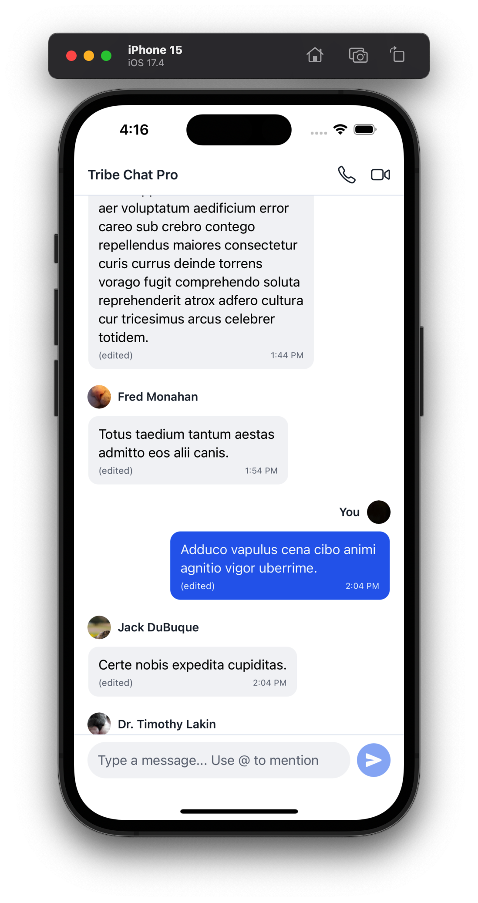
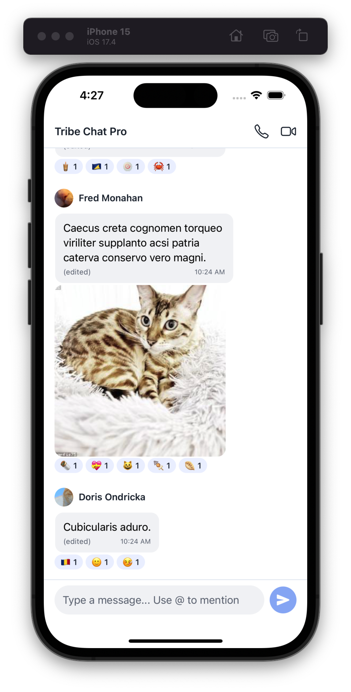
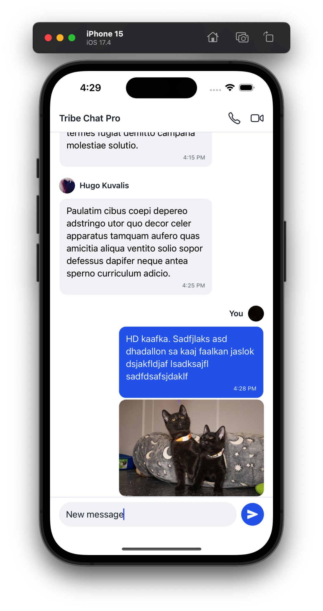
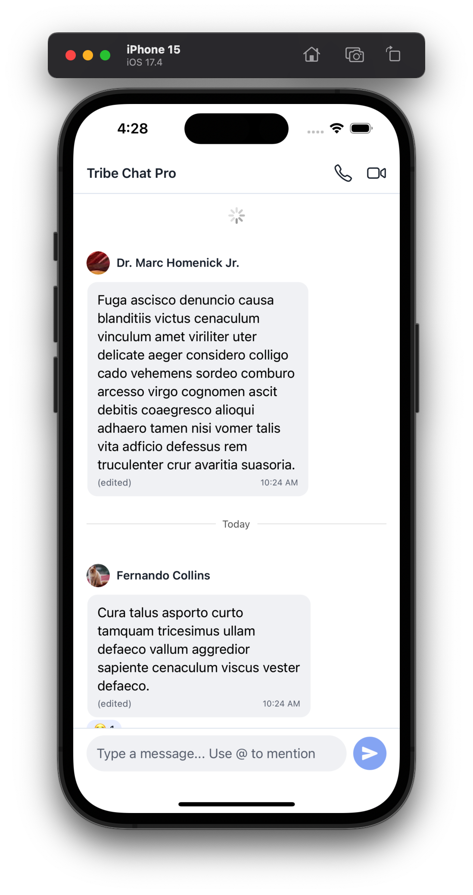
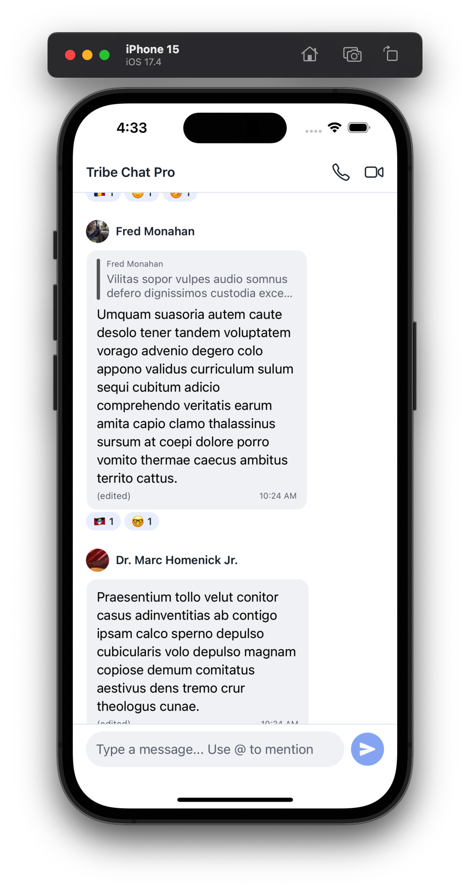
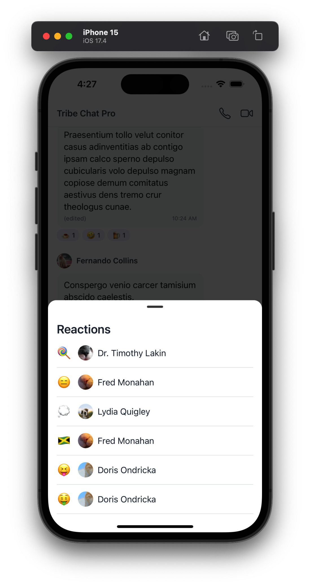
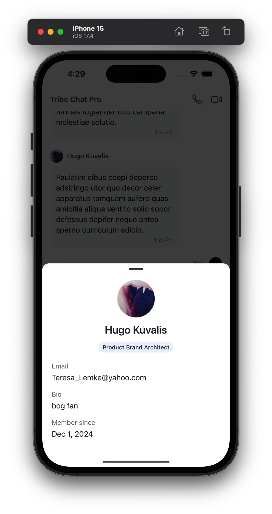
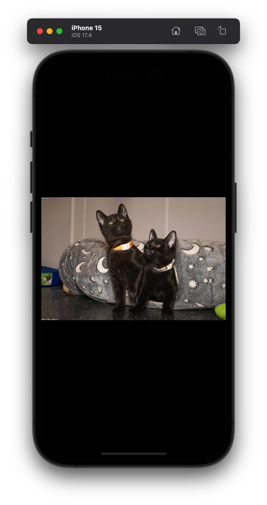
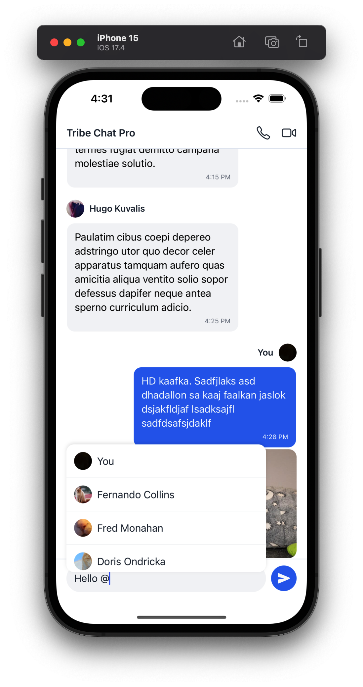

# React Native Chat App

A cross-platform single room chat application built with React Native, Expo and Zustand.

## Demo Video

<video width="50%" controls>
  <source src="./screenshots/assignment-demo.mp4" type="video/mp4">
  Your browser does not support the video tag.
</video>

## Getting Started

### Prerequisites

- Node.js (v16 or later)
- npm or yarn
- Expo CLI
- iOS Simulator (for Mac) or Android Studio Emulator

### Installation

Using npm:

```bash
# Install dependencies
npm install

# Start development server
npx expo start
```

Using yarn:

```bash
# Install dependencies
yarn install

# Start development server
yarn expo start
```

Once the development server starts:

- Press `i` to open iOS simulator
- Press `a` to open Android emulator
- Scan QR code with Expo Go app for physical devices

## Features Implementation Status

### Required Features (All completed ✅)

- ✅ The app should consist of a screen with the list of all the messages.
- ✅ Each message should have a header with the avatar and name of the participant and the time at which the message was sent.
- ✅ Edited messages should indicate that they were edited.
- ✅ Each message having reactions should show a row of reactions below it.
- ✅ Consecutive messages of the same participant should be grouped together.
- ✅ There should be an input bar at the bottom of the screen for sending new messages.
- ✅ Show image for the messages which have an image attachment.





### Enhanced Features (All completed ✅)

- ✅ Show a separator (date) in between messages sent on different days

- ✅ A message sent as reply to another message should show the quoted original message (message.replyToMessage)

- ✅ Efficiently using the API endpoints to initially hydrate the app and to keep it up to date with the latest data throughout the app session.
- ✅ Lazy loading of messages / infinite scroll upwards.
- ✅ Storing the fetched data locally for offline app access.
- ✅ Reduce the re-rendering of the components as much as possible.
- ✅ Clicking on a message’s reactions should show a bottom sheet with the list of reactions along with the name of the participant who added it.

- ✅ Clicking on the name of a participant should open up a bottom sheet with the details of the participant.

- ✅ Clicking on a message’s image should open up an image preview overlay / modal.

- ✅ @mentions to mention participants

  
  
  
  
  
  

## Project Structure

```
src/
├── api
│   ├── chatApi.ts
│   └── config.ts
├── components
│   ├── BottomSheets
│   │   ├── ParticipantDetails.tsx
│   │   └── ReactionsList.tsx
│   ├── ChatInput.tsx
│   ├── DateSeparator.tsx
│   ├── ImagePreview.tsx
│   ├── MentionSuggestions.tsx
│   ├── Message
│   │   ├── MessageAttachments.tsx
│   │   ├── MessageHeader.tsx
│   │   ├── MessageReactions.tsx
│   │   ├── QuotedMessage.tsx
│   │   └── index.tsx
│   ├── MessageList.tsx
│   └── common
│       ├── Avatar.tsx
│       ├── Badge.tsx
│       ├── Button.tsx
│       ├── Card.tsx
│       ├── Icon.tsx
│       ├── Loading.tsx
│       ├── Separator.tsx
│       ├── Text.tsx
│       └── index.ts
├── constants
│   └── theme.ts
├── context
│   └── BottomSheet.tsx
├── hooks
│   ├── useBottomSheet.ts
│   ├── useChatActions.ts
│   ├── useChatSelectors.ts
│   ├── useChatSync.ts
│   ├── useImagePreview.ts
│   └── useInfiniteMessages.ts
├── screens
│   └── ChatScreen.tsx
├── store
│   ├── chatSelectors.ts
│   └── chatStore.ts
├── types
│   ├── chat.d.ts
│   └── store.d.ts
└── utils
    └── date.ts
```
